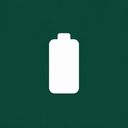
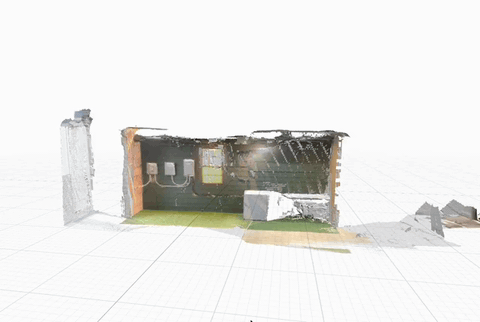

<div align="center">



# Base Site Survey

A native iPhone app that turns a homeowner's phone into a preliminary Base Power site survey — collecting electrical evidence, capturing a LiDAR scan of the meter and breaker panel, previewing a Base Core battery in AR against Base's published clearances, and exporting a portable review packet.

Not an electrical inspection, code review, or installation approval.

</div>

## Demo



> Prefer the higher-quality clip? Grab [`docs/media/demo.mp4`](docs/media/demo.mp4).

## Contents

- [What it does](#what-it-does)
- [The three steps](#the-three-steps)
- [Feature tour](#feature-tour)
- [Architecture](#architecture)
- [Getting started](#getting-started)
- [Running the app](#running-the-app)
- [Export packet](#export-packet)
- [Rules engine](#rules-engine)
- [Optional TypeSafe Jev advisory](#optional-typesafe-jev-advisory)
- [On-device equipment detector](#on-device-equipment-detector)
- [Site Scan Viewer (browser tool)](#site-scan-viewer-browser-tool)
- [How this maps to Base's intake](#how-this-maps-to-bases-intake)
- [What's stubbed](#whats-stubbed)
- [Research and proposed expansion](#research-and-proposed-expansion)
- [References](#references)

## What it does

Base Power asks homeowners for a home-form of typed answers and a photo kit of the meter yard and breaker panel; engineers then judge the site. This app is a guided phone-side stand-in for that flow. It:

1. Walks the homeowner through the same typed answers Base asks (with a MapKit-completed address, an optional GPS fix, and a battery-count decision helper backed by ERCOT price samples).
2. Runs a hands-free outdoor AR scan (the Live Survey) that captures the electric meter and breaker panel by itself once an on-device YOLO detector and Vision OCR agree on a good image, reconstructs a LiDAR mesh, and records posed keyframes with depth. Numbers read by the scan are suggestions the user confirms in Review.
3. Previews a to-scale Base Core cabinet in AR, tinted **green / teal / amber / red** against Base's Austin siting rules. Green needs measured evidence for every required check; a user's statement is attested, not measured (teal).
4. Writes `survey.json` and a `BaseSiteSurvey-<date>.zip` you can share; a companion browser viewer maps every square-foot of the scan for candidate battery placements.

The Xcode target is `BaseAR`; the home-screen name is **Base Site Survey**. Agent and team rules are in [`AGENTS.md`](AGENTS.md).

## The three steps

Splash → Welcome → **Home Info** → **Live Survey** → **Review & Export**. A step indicator on Home Info and Review moves between them.

1. **Home Info.** First launch opens a short onboarding wizard, then the full form: name, email, phone, address with MapKit suggestions, own or rent, solar, portable generator, standby generator, existing whole-home battery, planned batteries (1 or 2) with the decision card, the panel bus rating when solar or two batteries apply, and "Gas meter outside: Yes / No / Not sure". The property location fix shows on a map with its accuracy circle.
2. **Live Survey.** The camera with no top bar and exactly two lines of text:
   - the **top** line is the current job, and it changes as each job completes;
   - the **bottom** line is live feedback with a small animated graphic ("Point at the meter", "Get closer", "Hold still", "Found the meter", …).

   There is nothing to tap. The app captures by itself when it recognizes the target reliably and the image is good. The order is the meter and its number, the panel (and the main breaker size when its label reads; a read is a suggestion until you confirm it in Review), the gas meter (only when Home Info said Yes or Not sure), a step back to look around, then the battery. The app suggests a spot beside the meter wall (slide it with one finger, including to the other side of the meter; turn it with two), accepts it once the phone holds still, and tints it with the live tone. Then the scan saves itself and opens Review. A step that cannot finish moves on after a while and leaves that item for Review, so the scan never traps you. Distances never appear on the camera. To leave early, swipe right from the left edge; the scan so far is kept and you go back to the step you came from.
3. **Review & Export.** "What's missing" rows take you to the fix (Home Info, the Live Survey, or the Electrical screen to retake a photo or type a number). Numbers read by scan are marked "read by scan" until you confirm them here. Then property, electrical, site-measurement, and eligibility details, a `survey.json` preview, and Share (see [Export packet](#export-packet)). Start over deletes the survey.

## Feature tour

### Home & personal info
- Name, email, phone, and address (with MapKit typeahead suggestions).
- Own / rent, existing solar, portable generator, whole-home standby generator, existing whole-home battery — all radio-buttoned to match Base's Get Started form.
- Planned battery count (1 or 2) with an inline **battery-count decision card**: capacity, backup hours at ~3 kW load, and annualized wholesale-arbitrage $/day derived from an embedded ERCOT price sample keyed to the property's load zone.
- One-shot property GPS fix (lat, lon, timestamp, reported horizontal accuracy) shown on a map with an accuracy ring. Precise-location is requested; if the user only grants approximate, that's what is recorded.

### Electrical capture
- The Live Survey saves the meter and panel photos from its own capture. The Electrical screen, opened from Review, can retake a photo or type a number.
- Round-meter photo capture through a native camera picker; the JPEG is baked upright (no EXIF-only rotation).
- **Live label scanner** overlays the camera preview with a card-style highlight around the meter nameplate, aggregating Vision text observations across frames until the meter number stabilizes.
- Photo-fallback OCR: attaching an existing library photo also runs Vision recognition on the still.
- Typed main-breaker amperage is the value of record — OCR is a suggestion, not an override.

### AR placement and site scan
- Outdoor `ARView` with horizontal and vertical plane detection, LiDAR mesh occlusion on supported devices, and plane-raycast placement on devices without LiDAR.
- **One hands-free Live Survey** covers the meter, the breaker panel, the gas meter, a look-around, and the battery. It has no buttons: the top line names the job, the bottom line coaches, and each step advances by itself or times out into Review's "What's missing".
- **On-device YOLO detector** (`EquipmentScan.mlpackage`, YOLO26n fine-tuned at 640 px) draws candidate meter / panel boxes on the camera (no text on them in release builds). A meter or panel locks through the **capture gate**: a steady, sharp, well-lit box on a wall at a plausible height whose label (the meter number, or the rating beside MAIN) reads the same twice. A meter whose label never reads twice (glare, a dirty cover, a barcode-only plate) can still lock after 20 s of searching as a plain detector lock: five agreeing wall hits at the lock score (0.45) on a sharp, exposed box, with no suggested number. The panel has no such fallback. The detector stops once both are locked. Every lock records its source (`scanCapture` / `detector`; `hold` and `tap` stay in the code, off).
- **Battery preview**: a to-scale Base Core cabinet (30.68 in W × 35.9 in H × 22 in D) is placed on the ground; a separate 3 ft × 3 ft planning footprint and a transfer-switch working space beside the meter are drawn as overlays.
- Live tint: the cabinet uses the same full assessment as Review: **green** only when every required rule passes on measured evidence, **teal** when every rule passes but some pass on the user's statement, **amber** if anything is unknown, **red** on an observed conflict. The two electrical rules always rest on the user's reading of a label, so a complete survey reads teal at best today.
- **Keyframe recorder** captures posed camera photos + depth + intrinsics during the scan: an anchor frame at every meter / panel lock, then a new frame after ~0.4 m of movement or a ~20° turn, only while the phone is steady. Up to 120 frames per scan, all rotated upright to match how the phone was held.

### Review and export
- Opens by itself when the Live Survey saves, or from the step indicator.
- Grouped next actions at the top; collapsible cards for property, electrical, placement, and every rule result, each with a direct edit link back to its section.
- Optional collapsed **Jev advisory** card when a TypeSafe key is set (see below).
- `Share` writes one zip — `BaseSiteSurvey-<yyyy-MM-dd-HHmm>.zip` — unpacking to a single folder with the survey, photos, LiDAR mesh, and the full keyframe stream. See [Export packet](#export-packet).

## Architecture

```
BaseAR/
├─ Survey/        SurveySession · SurveyStore (composition root) · ToneStyle
├─ Onboarding/    Splash + first-launch Home Info wizard
├─ Location/      PropertyLocationProvider · MapKit AddressCompleter · map view
├─ Electrical/    Camera picker · LiveLabelScanner · Vision OCR (meter number
│                 + breaker amperage) · MeterNumberRecognizing protocol
├─ Placement/     PlacementARView (Live Survey + scene controller) · CaptureQuality
│                 PlacementMeasuring · KeyframeRecorder
│                 EquipmentDetecting (Core ML) · BatteryCatalog / Geometry
│                 EquipmentScan.mlpackage (YOLO26n)
├─ Grid/          ERCOTLoadZone · LoadZoneLookup · ERCOTPriceSample
│                 GridService · BatteryCountDecision + card
├─ Rules/         EligibilityRule · BaseRuleSet · SurveyEvaluating
└─ Review/        ReviewView · SurveyExporting (zip + PLY writer) · TypeSafeJev*
```

`SurveyStore` is the composition root. The three parallel workstreams meet at three protocols so they can be developed independently and mocked in isolation:

| Workstream | Owns | Protocol |
|---|---|---|
| Electrical capture / OCR | Meter photo, meter number, breaker amperage | `MeterNumberRecognizing` |
| AR placement & measurements | Battery position, meter / panel / gas anchors, distances, LiDAR mesh, keyframes | `PlacementMeasuring` |
| Rules & review export | Rule outcomes, tone, zip / PLY export | `SurveyEvaluating` |

Every capability is Apple-frameworks only: SwiftUI, ARKit, RealityKit, Vision / VisionKit, Core ML, Core Location, MapKit. No backend, no accounts, no third-party dependencies.

## Getting started

Each teammate does this once per Mac. `git pull` never disturbs signing — those files are gitignored.

> **Already set up before 27 September 2026?** Re-run `./scripts/bootstrap-signing.sh` once to turn on the git hooks (your `Local.xcconfig` is kept), and check that its `DEVELOPMENT_TEAM` matches your team in Xcode → Settings → Accounts. Older versions of the script could write the wrong ID.

1. **Sign in to Xcode with your Apple ID.** Xcode → Settings → Accounts → **+** → Apple ID. Without this Xcode has no cert to sign with and every device build fails with *"No Account for Team … / No profiles for …"*.
2. **Generate your local signing config.**
   ```sh
   ./scripts/bootstrap-signing.sh
   ```
   Reads the Team ID from your certificate's team field, derives a bundle ID like `com.<your-username>.BaseAR`, and writes both to `Config/Local.xcconfig` (gitignored). If your certificates belong to several teams, pass one: `./scripts/bootstrap-signing.sh TEAM_ID`. It also turns on the repo's git hooks. To do it by hand: copy `Config/Local.xcconfig.example` to `Config/Local.xcconfig`, fill in the two lines, and run `git config core.hooksPath .githooks`.
3. **Open `BaseAR.xcodeproj`** and confirm *Automatically manage signing* is checked on the `BaseAR` target. The first build pulls down a provisioning profile.

   **Don't pick a team in Signing & Capabilities.** Xcode writes that choice into `project.pbxproj`, where it overrides every teammate's `Local.xcconfig` and breaks their builds. The pre-commit hook blocks a committed `DEVELOPMENT_TEAM`.
4. **On device, trust the developer profile** the first time: Settings → General → VPN & Device Management → tap your profile → **Trust**.

## Running the app

Select the `BaseAR` scheme and a physical iPhone running **iOS 17+**, outdoors or anywhere the phone can see the ground and a wall. Allow camera, and *While Using* location on Home Info. The location is the phone's property fix, not the battery position. If camera access is off, the Live Survey says so and waits; turn it on in Settings.

AR placement requires a device — the simulator can walk the survey and reach review, but world tracking stays unavailable there.

**Signing-free build check** (paste its `BUILD SUCCEEDED` in every PR):

```sh
xcodebuild -project BaseAR.xcodeproj -scheme BaseAR \
  -destination 'generic/platform=iOS' CODE_SIGNING_ALLOWED=NO build \
  2>&1 | grep -E 'error:|BUILD (SUCCEEDED|FAILED)'
```

**Signing-free simulator build** (useful in CI or a clean checkout):

```sh
DEVELOPER_DIR=/Applications/Xcode.app/Contents/Developer xcodebuild \
  -project BaseAR.xcodeproj \
  -scheme BaseAR \
  -destination 'generic/platform=iOS Simulator' \
  -configuration Debug \
  CODE_SIGNING_ALLOWED=NO build
```

**Device build from the command line** (after step 1 above):

```sh
DEVELOPER_DIR=/Applications/Xcode.app/Contents/Developer xcodebuild \
  -project BaseAR.xcodeproj \
  -scheme BaseAR \
  -destination 'generic/platform=iOS' \
  -configuration Debug \
  -allowProvisioningUpdates build
```

If `xcodebuild` says it is using Command Line Tools instead of Xcode, either prefix as above or run `sudo xcode-select -s /Applications/Xcode.app/Contents/Developer` once.

Install only from a commit, never from uncommitted patches. A black camera is not a mirroring or Device Hub problem: the back lens is covered or sees nothing, and the bottom line says so.

## Export packet

Sharing from the review screen writes a single zip that unzips to one folder:

```
BaseSiteSurvey-2026-09-26-2041/
├─ survey.json          Full SurveySession (personal, electrical, placement,
│                       rule results, tone, ERCOT grid context, device provenance)
├─ meter.jpg            The meter photo from the scan capture or the Electrical
│                       screen (upright JPEG)
├─ panel.jpg            The panel photo from the scan capture, when it locked one
├─ scene.ply            ASCII LiDAR mesh — per-vertex RGB from camera,
│                       per-face ARKit label (wall / floor / window / door /
│                       ceiling / …), and header `mark` lines for the meter,
│                       panel, gas meter, battery, footprint, and distance bars,
│                       coloured pass / conflict / unknown
└─ capture/
   ├─ frames.json       Per-frame index, timestamp, intrinsics, camera→world
   │                    pose, exposure, orientation — in the same AR world as
   │                    scene.ply
   ├─ frames/NNNNNN.jpg Upright rotated JPEGs (no EXIF)
   ├─ NNNNNN.depth.bin  Raw Float32 little-endian depth in meters
   └─ NNNNNN.conf.bin   UInt8 depth confidence (0 low · 1 medium · 2 high)
```

`scene.ply` opens directly in MeshLab, CloudCompare, or Blender. The keyframe stream is enough to re-photogrammetry the yard or run a downstream 3D pipeline.

## Rules engine

Every eligibility check returns `pass`, `conflict`, or `unknown`, and records whether it used **measured** or **attested** evidence.

- **Green**: every required check passed on measured evidence.
- **Teal**: every required check passed, but some passes are your statements (the typed or confirmed main breaker, the panel bus rating typed from its label, "no solar and one battery", or "No gas meter").
- **Amber**: something is still unknown.
- **Red**: a measured conflict.

Checks 1 and 2 always rest on the user's reading of a label, never a measurement, so a complete survey reaches teal at best until the app measures them. A number the scan reads is a suggestion ("read by scan"): the breaker check stays unknown until the user confirms it in Review. The panel bus rating is never inferred from the main breaker. Pad and transfer-switch clearance come from the LiDAR mesh once enough of the area was seen; without LiDAR those checks stay unknown, so the preview stays amber.

| # | Check | Threshold |
|---|---|---|
| 1 | Austin main breaker | 150–200 A |
| 2 | Solar or two batteries | 200 A panel |
| 3 | Battery footprint | 3 ft × 3 ft clear |
| 4 | Distance to meter | ≤ 20 ft |
| 5 | Distance to wall | ≤ 1 ft |
| 6 | Not in front of a window | Wall clear where cabinet backs onto |
| 7 | Equipment working space | 30 in × 36 in clear |
| 8 | Distance to gas meter | ≥ 3 ft |
| 9 | Meter height | 3–6 ft |
| 10 | Meter & panel share a wall | Two wall locks aligned |
| 11 | Transfer-switch space beside meter | ≈ 13 in × 3 ft × 30 in |
| 12 | Front working space clear | 30 in × 36 in ahead of cabinet |

Austin thresholds live in `BaseAR/Rules/BaseRuleSet.swift` and follow Base's public guidance (linked below).

## Optional TypeSafe Jev advisory

Review can show a collapsed "Jev advisory" card that asks TypeSafe Jev how ready the survey looks. It is advisory only and never changes a check, the tone, or `survey.json`. It appears only when a key is set; with no key there is no card and no network call. To try it, add one line to your gitignored `Config/Local.xcconfig`:

```
TYPESAFE_API_KEY = your_key_here
```

The committed `Config/BaseAR.xcconfig` keeps it empty. You can also set `TYPESAFE_API_KEY` as an environment variable in the Xcode scheme. Never commit a key. The request sends check results and home answers, never name, contact details, address, location, meter number, or photos. Errors and timeouts show "Advisory unavailable".

## On-device equipment detector

`BaseAR/Placement/EquipmentScan.mlpackage` is a YOLO26n model fine-tuned at 640 px to find the electric meter (class 0) and breaker panel (class 1). It runs live on the AR camera stream while a meter or panel is still unlocked; boxes are drawn at ≥ 0.30 confidence. It only proposes: a lock also needs the capture gate above (wall or depth landing, a streak of good frames, the separation and height guards, and a label read twice; for the meter only, after 20 s, five agreeing hits at ≥ 0.45 without a read). AC units can score as meters.

Training assets live in `training/` (gitignored) so each machine rebuilds:

1. `uv venv --python 3.12 training/.venv && uv pip install --python training/.venv/bin/python ultralytics coremltools "git+https://github.com/ultralytics/CLIP.git"`
2. `python3 scripts/fetch_commons.py` — ~400 CC-licensed Wikimedia Commons photos, credits in `training/raw/sources.csv`.
3. Drop hand-labeled site photos into `training/site/` with a YOLO `.txt` label beside each. They're triplicated in training; four are held out for validation (`VAL_STEMS` in `autolabel.py`).
4. `training/.venv/bin/python scripts/autolabel.py` — YOLOE-26l drafts meter boxes for the Commons photos. Review `training/review/` and list bad images in `training/exclude.txt`. Commons panels are skipped (European switchboards).
5. `training/.venv/bin/python scripts/train_equipment.py` — trains on the Apple GPU and writes the Core ML package into the app.

Every panel example so far comes from one demo wall — expect weaker panel detection at other houses until more site photos are added.

## Site Scan Viewer (browser tool)

`tools/viewer/` is a React + Vite + Tailwind + three.js viewer that opens an exported survey zip (or loose `scene.ply` + `survey.json`) and answers one question: **where on this scan can a Base Core actually stand?**

- Small coloured squares cover scanned ground within 20 ft of the meter — green (candidate), red (conflict, hover for which check), amber (needs more scan), gray (why not), pale amber (surface scanned too low to confirm as a house wall).
- Select any square to see the full 3 ft × 3 ft footprint plus both side-clearance regions with every rule result for that spot.
- View toggles: camera-colour vs ARKit labels, 3D vs top-down, grid, floor layer, cutaway above 2.2 m, ceiling.
- Runs entirely in the browser — nothing uploads. `npm run build` inlines everything into one ~1 MB `dist/index.html` you can email to a reviewer.

See [`tools/viewer/README.md`](tools/viewer/README.md) for details.

## How this maps to Base's intake

Base's public request is two steps (researched 2026-09-26). [Get Started](https://www.basepowercompany.com/get-started) collects ownership, energy setup, address, and contact. Engineers later judge the site from a separate [photo kit](https://help.basepowercompany.com/en/articles/10280641): meter with a legible number, wide shots around the meter (surrounding, left, right, adjacent wall, behind the fence), breaker box, disconnect amperage, and breaker-area context. Full comparison: [`reports/Base battery form vs app.md`](reports/Base%20battery%20form%20vs%20app.md).

This app already asks Base's typed home-form questions and stores the meter and panel photos from the Live Survey, the meter number and main breaker (read by scan and confirmed, or typed), and a full LiDAR + keyframe capture. It does **not** yet capture Base's wide meter-yard compositions. Meter height, front working space, and shared-wall status are AR measurements, not home-form answers. Everything stays on the phone.

## What's stubbed

- **AR measurements** are preliminary raycast + LiDAR estimates and still need physical-device field verification; they do not replace an installer measurement.
- **Wide photo kit** (left, right, surrounding, adjacent wall, behind the fence, breaker-area context) is not yet captured — the keyframe recorder captures posed frames but not the specific compositions Base asks for.
- **No Base backend, no ERCOT live feed, no permitting logic.** ERCOT prices are an embedded sample keyed to load zone; the meter and panel boxes come from an on-device model and are not an electrical inspection.
- **The detector needs retraining** on phone frames from at least 3 houses. A meter or panel it never boxes cannot be marked in the Live Survey (there is nothing to tap); its checks stay unknown and Review lists it.
- **Open team calls**, listed in `docs/context/README.md`: the 3 ft meter-height minimum, meter and panel on opposite sides of one wall, the working-space shape, and whether the electrical checks should count toward the siting color.

## Research and proposed expansion

The [context pack](docs/context/README.md) holds the 26 September electrical guide, the scan-coverage design, and the verified repo status. The [site-survey research index](docs/site-survey-research/README.md) preserves the 26 September research, source links, product decisions, and a proposed end-to-end expansion: utility and program routing, public electrical and property data, placement constraints, a 30-rule research catalog, source coverage, and an implementation handoff.

These documents are research context, not implemented functionality or installation approval. Their code snapshots are older; recheck code-specific findings against current `main`, and do not promote unresolved or model-specific guidance into universal rules.

## References

- Base Core specs: <https://www.basepowercompany.com/specs/core>
- Base site requirements: <https://help.basepowercompany.com/en/articles/10280705>
- Base photo kit: <https://help.basepowercompany.com/en/articles/10280641>
- Detailed home-form vs app comparison: [`reports/Base battery form vs app.md`](reports/Base%20battery%20form%20vs%20app.md)
- Agent / build conventions: [`AGENTS.md`](AGENTS.md)
