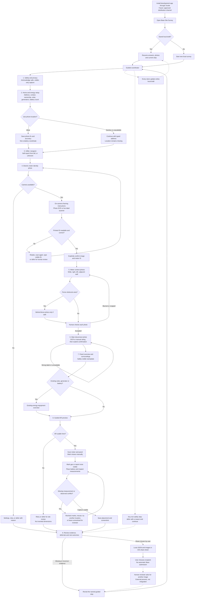

# Base Site Survey: End-to-End Guided Workflow

Implemented on `feat/guided-site-survey`, starting from main commit `727c9817a85884b12ca343ccf3ff2ecb370b412a`. This is a native SwiftUI implementation around the existing meter scanner, breaker scanner, and AR equipment/placement work, not a replacement app or a production eligibility engine.

## Product decision

Build the **guided evidence collection and correction loop**. The product is not “take two pictures and show a battery.” It should help someone provide the right evidence, understand the next safe action, and send a useful preliminary packet without mistaking guesses for electrical decisions.

The nine published Base photo compositions include identity photos, wide surroundings, side views, an adjacent wall, conditional fence context, and panel/disconnect context, not just two closeups ([Base photo instructions](https://help.basepowercompany.com/en/articles/10280641)). The implementation adds those context slots, plus a safely visible panel nameplate and a conditional existing-energy-equipment overview.

## Current-app evaluation

This evaluation is source inspection of the starting commit, not an observed device usability test. The branch changes below have not been compiled with Xcode in this environment.

| Area | Starting app | Branch implementation |
| --- | --- | --- |
| First launch | Welcome, then four independent hub tiles | Welcome, then a nine-step guided coordinator; all-step navigation remains available after safety acknowledgment |
| What to do next | User chooses the next tile | Instructions, missing-item checklist, Continue, Back, and explicit review routes |
| While holding phone | Live label scan has framing and candidate feedback; standard camera has no task instruction | Standard camera also has a task-specific coaching overlay; existing live OCR is preserved |
| Meter/main rating | OCR or typing fills a field; breaker UI calls some values “Confirmed” automatically | Explicit image/value confirmation; edits and retakes clear confirmation |
| Scanner feedback | Last candidate can remain selectable after text leaves the frame | Candidate is invalidated when no readable label remains in the frame |
| Context evidence | Meter photo, breaker photo, AR screenshot | Named meter-wall, left/right, adjacent-wall, fence, panel, nameplate, and conditional equipment photos |
| Unsafe/inaccessible evidence | No structured escape path | Any non-safety step can be deferred with a reason; missing evidence stays missing |
| Save/resume | Session created on Start; JSON written during review/export despite “save as you go” copy | JSON saved on store mutations; active draft restored on Resume, including images, answers, confirmation flags, and current step |
| AR entry | Minimal mode default; guided measurement walkthrough hidden behind Measure | Existing guided walkthrough enabled by default |
| Rule scope | Austin main range applied to all sessions | Austin comparison only after an explicit Austin Energy answer and breaker confirmation; program remains self-reported |
| Panel rule | Main-breaker amps used to pass a panel-rating requirement | No inference from main-breaker amps; solar/two-battery cases require nameplate/human review |
| Meter height | Unsupported three-foot minimum alongside six-foot maximum | Remove the three-foot minimum; retain preliminary maximum-height comparison |
| Export | JSON plus original three image slots | JSON plus every saved context image; accepted/unaccepted and deferred state travels with the packet |

## Journey and feedback loops

Installation is an external precondition. The repository supports an Xcode-installed development app; it does not implement App Store publishing, downloads, TestFlight distribution, Base enrollment, account creation, or backend submission.



The diagram describes the journey, not a mandatory navigation lock. After acknowledging safety, users can revisit any step or share an incomplete draft; the step checklist and deferrals make that incompleteness explicit.

## Step-by-step behavior

| Step | Instruction while using the phone | Evidence and transition |
| --- | --- | --- |
| Safety | Stay on safe ground. No covers, seals, breaker operation, climbing, wiring contact, or damaged/wet equipment | Acknowledgment is the one non-deferrable gate. Photos are stored locally; share requires user action |
| Home | Confirm address and contact, then energy setup | Nonblank address/name, basic email/phone checks, ownership and setup answers. Location is optional for progression, remains listed if absent |
| Utility | Read utility name from bill; GPS/city is not a program determination | Austin Energy, retail-choice service, another utility, or unknown; optional typed utility name. Explicitly save the answer |
| Meter | Stand still; frame printed identity label; reduce glare. Do not confuse meter ID with cycling consumption display | Photo + candidate/manual meter ID + explicit human confirmation. Retake/edit clears acceptance |
| Meter context | Put the phone down or look up before changing position; do not walk backward watching the display | Wide wall/ground, right, left, adjacent wall. Fence question conditionally adds behind-fence photo. User accepts each image or defers the step |
| Main disconnect | Locate the main rating, not a branch breaker, meter CL marking, or panel bus rating | Separate photo + amps + explicit human confirmation. No need to open anything; unreadable evidence can be deferred |
| Panel context | Show the whole enclosure, location and safely visible nameplate | Separate overview/context/nameplate images. Solar/generator/battery answers conditionally add an equipment overview |
| AR | Stand still to scan; move slowly on safe ground; mark missed equipment; check gas; place battery | Existing scanner/manual marks and measurement UI. Save screenshot. Unsupported devices and incomplete captures can defer |
| Review | Inspect pictures and unresolved items; tap a named step to correct it | JSON includes human confirmation, photo quality acceptance, deferral reasons and rule outcomes. Share draft at any completeness level |

### Capture loop

- **Before camera:** State the subject and the composition. Give a safe alternative before any action requiring access.
- **During regular camera:** Keep a task-specific instruction visible above the native camera. This is static coaching, not a blur/glare classifier.
- **During live OCR:** Keep the existing frame and hold-steady candidate interaction. A lost label now clears the old candidate rather than retaining a selectable stale value.
- **After capture:** Show the image and entered value; require the user to compare them. Context photos have an explicit sharp/correct/not-cropped acknowledgment.
- **Correction:** Retake, edit a visible value, scan again, or return to the guide to defer. A retake invalidates photo acceptance; changing a value invalidates number confirmation.
- **Safety:** Deferral records a reason, permits progression, and remains in review/export. It never passes a rule. Deferrals are currently step-level, not per-photo tickets.

### Review loop

Review displays saved context images, utility self-report, outstanding steps and deferrals alongside the existing rule results. A “Revisit” action sets the named step and returns to the coordinator; fixing the evidence does not silently erase an existing deferral, which the user can remove explicitly after resolving it.

No server marks a survey submitted or approved. The iOS share sheet is the handoff boundary, and a reviewer requesting a retake is an external process for now.

## State, persistence and code map

- **`SurveyWorkflow.swift`:** Step names/instructions, utility choices, photo slot catalog, per-step missing evidence, conditional photos and Continue policy. No network or Apple camera dependencies.
- **`GuidedSurveyView.swift`:** Nine-step coordinator, progress, sheets around existing screens, on-screen guidance, context capture, deferral form, revisit controls and review routing.
- **`SurveySession.swift`:** Schema 5 adds optional `guidedProgress`. Keeping the new field optional permits decoding a schema-4 packet that has the other existing fields.
- **`SurveyStore.swift`:** Central updates, local draft write, active-draft pointer, restoration, JPEG attachment, acceptance invalidation and expanded export. OCR generations now invalidate on manual edits and retakes.
- **`ElectricalCaptureView.swift`:** Safety copy, photo/value confirmation and removal of the implicit green “Confirmed” label.
- **`CameraImagePicker.swift`:** Optional coaching overlay, retaining native shutter/cancel controls and the existing simulator photo-library fallback.
- **`LiveLabelScanner.swift`:** Existing VisionKit scanner with stale-candidate invalidation and in-frame candidate selection.
- **`PlacementARView.swift`:** Existing AR implementation, now opening the guided measurement mode by default.
- **`BaseRuleSet.swift`:** Explicit program-review unknown, scoped Austin comparison, panel-rating correction, meter-height correction, conservative provenance for self-report.
- **`ReviewView.swift`:** Context-photo inspection and guided correction routes.
- **`BaseAR.xcodeproj/project.pbxproj`:** Both new Swift files added to the app target.

### Persistence contract

One active draft is selected through a UserDefaults UUID; data and images live under the existing `Documents/Surveys/<UUID>` directory. Each store mutation reevaluates the session and atomically writes `survey.json`; this is deliberately simple for a hackathon rather than a database or sync system.

Resume restores answers, images, accepted flags, current step, deferred reasons, and the last saved placement evidence. It does **not** restore an AR world map, live anchors, or a prior spatial session; opening AR again creates a new scan, while the saved screenshot/measurements remain a previous observation until replaced.

Missing image files are invalidated on resume. A damaged JSON draft fails visibly rather than silently creating a replacement; repair/import/recovery tooling is not implemented. Start over remains an explicitly confirmed destructive action from Review.

An address edit invalidates the utility answer, phone fix, accepted electrical/context evidence and AR placement. Existing photos remain as drafts to recheck, while a genuinely different household should use Start over to avoid carrying forward contact/setup answers.

### Export contract

The packet contains `survey.json`, meter and breaker JPEGs, a placement JPEG when saved, and every saved context JPEG. The optional `guidedProgress` object contains:

```json
{
  "currentStep": "review",
  "safetyAcknowledged": true,
  "program": "unknown",
  "utilityName": "",
  "programAnswered": true,
  "meterConfirmed": true,
  "breakerConfirmed": false,
  "fencePresent": false,
  "contextPhotos": {
    "meterWide": {
      "filename": "context-meterWide.jpg",
      "capturedAt": "2026-09-26T12:00:00Z",
      "accepted": true
    }
  },
  "deferred": {
    "breaker": "Rating is not visible without opening a cover."
  }
}
```

This is illustrative synthetic data, not a household record. The packet can include unaccepted photos and photos from a previously applicable conditional slot, clearly represented by their stored metadata; sharing sends the saved evidence, not a claim that it all passed review.

## Electrical and regulatory boundaries

Austin Energy's published Base program places the battery in front of the billing meter; that is a program-specific fact, not a general “regulated versus unregulated” wiring rule ([Base Austin Energy program](https://www.basepowercompany.com/austinenergy)). The implementation therefore records program self-report but does not instruct a homeowner where to interconnect anything.

Base's electrical guidance distinguishes main-breaker ranges, a 200A panel condition for solar/two batteries, site placement constraints, and a maximum meter height ([Base electrical requirements](https://help.basepowercompany.com/en/articles/10280705)). The branch stops using main-breaker amperage to satisfy a panel-rating check and removes the unsupported three-foot meter-height minimum.

Other retained distance comparisons are preliminary prototype guidance, not a verified per-model/per-jurisdiction rule catalog. The new required `program-review` result intentionally remains **unknown**, so a full set of photos and apparent distance passes cannot turn into whole-site approval; an observed numerical conflict can still appear as a conflict needing review.

No screen should say:

- “Your meter must be replaced” from appearance or OCR alone.
- “A closed window is exempt.”
- “All regulated utilities install before the meter.”
- “No visible gas meter proves no gas hazard.”
- “Main breaker 200A proves panel bus 200A.”
- “Photo checklist complete means eligible/approved.”

The earlier research remains separate and auditable in the [research branch](https://github.com/nikitaroz/base-ar/tree/docs/site-survey-research-2026-09-26/docs/site-survey-research). This feature does not silently promote that research catalog into executable permitting rules.

## Validation and remaining work

### Validation performed in this environment

The environment is Linux and does not contain Xcode, `xcodebuild` or Swift. Syntax/project checks are useful but do not establish that SwiftUI type checking, SDK availability, signing, permissions, UIKit camera overlays, or AR device behavior work.

See `guided-survey-validation.md` for the recorded static checks and device acceptance checklist. No unit tests were added, following the repository instructions.

### Required next device pass

Build in Xcode and walk the full flow on a physical iPhone. Give special attention to camera-overlay positioning, navigation sheet dismissal, Dynamic Type, VoiceOver, permission denial, photo persistence, scanner candidate loss, non-LiDAR measurement behavior and relaunch after a saved placement.

### Explicitly not implemented

- **Automatic quality scores:** No blur/glare/coverage model. The acceptance check is user attestation.
- **Property-data lookup:** No public parcel, permit, utility territory, equipment inventory or account integration.
- **Code engine:** No automatic local-code validation, window/vent/gas-heater classifier, approved-meter lookup or replacement decision.
- **Backend handoff:** No Base submission API, authentication, reviewer inbox, push notifications or correction-ticket sync.
- **Production persistence:** No multi-draft manager, backup-exclusion policy, import recovery, encryption layer beyond platform storage, retention settings or batch export/archive.
- **AR world recovery:** No persisted/relocalized world map. Source inspection does not certify measurement accuracy or model-detection quality.

The next most useful improvement is a short, observed homeowner capture trial followed by an engineer review of the resulting packet. Fix the highest-frequency evidence failure before expanding into Base OS or automated electrical decisions.
