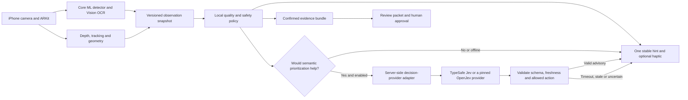

# BaseAR: Real-Time Guidance Assessment

Assessment date: September 26, 2026. Recommendation: keep the native perception/AR pipeline and guided survey, fix spatial evidence integrity first, then evaluate an optional Jev decision layer over structured observations; do not make a cloud model the camera loop or electrical authority.

## Standing against the hackathon rubric

The published rubric allocates 30 points to technical execution/completeness, 30 to track fit, 20 to value/impact, and 20 to innovation/execution, and judges the working system through a five-minute video and codebase ([official hackathon guide](https://common-scooter-829.notion.site/Base-AITX-Talent-Hackathon-3e01e636288e80a7b914c993f90ae6c5?utm_source=luma)). The strongest primary fit is Track 3, Most Commercializable; Track 2 should be claimed only if the demonstrated runtime genuinely coordinates independent components and survives their failures, not merely because development used multiple coding bots.

The following **69/100 is an internal, subjective source-review estimate**, not an official score, measured outcome, win probability or placement against the two other teams. No competitor demos, native build result, completed phone walkthrough, homeowner trial or engineer acceptance result were supplied.

| Published category | Internal estimate | Reasoning |
| --- | ---: | --- |
| Technical execution/completeness | 19/30 | Real native capture, OCR, Core ML detection, AR geometry, state and export exist; integrated phone behavior and critical evidence-validity cases remain unproven |
| Fit to Track 3 | 28/30 | Clear Base-specific capture/review problem, concrete homeowner and reviewer workflow, rather than an unrelated AI demo |
| Value/impact | 11/20 | Potential to reduce recapture and review effort; no observed reduction or independent reviewer acceptance yet |
| Innovation/execution | 11/20 | Useful integration of perception, geometry and guided evidence; latency, thermal behavior, differentiation and live recovery are not demonstrated |
| **Total** | **69/100** | Strong product direction, incomplete evidence of reliability |

Current qualitative standing: a credible guided-survey prototype, not yet a demonstrated adaptive site-assessment assistant. A precise ranking against the two other teams would be invented; differentiation should be demonstrated as fewer unusable captures and clearer engineer handoff, not just a battery rendered in AR.

## What the repository actually has

Code inspection at guided implementation `9cc7dbc` found a nine-step coordinator, safe deferrals, explicit meter/main confirmation, local draft resume, context photos, review loops and local sharing, as described in the [implementation workflow](https://github.com/nikitaroz/base-ar/blob/feat/guided-site-survey/docs/guided-survey-workflow.md). Native build and device validation remain outstanding in the [validation record](https://github.com/nikitaroz/base-ar/blob/feat/guided-site-survey/docs/guided-survey-validation.md).

The detector maps two classes, electric meter and breaker panel, and attempts a request at most once per quarter second while tracking is normal. That is a scheduling ceiling, not measured inference throughput or a demonstrated frame rate; wider hazard recognition and adaptive blur/glare/coverage feedback are not implemented.

Ordinary capture uses static instructions and human photo-quality acceptance. Live OCR does provide candidate feedback, but adding Jev cannot recover visual evidence that the local capture pipeline never measured.

## Highest-priority engineering findings

These are source-inspection findings, not reproduced device failures. Two independent bounded reviews supported this assessment: a repo/readiness audit and a Jev/provider comparison; they did not change runtime code or establish native-build success.

| Priority | Finding | Relevant code | Required behavior |
| --- | --- | --- | --- |
| P0 | Missing new measurements can retain old clearance booleans | `PlacementMeasuring.swift`, `applying` | Replace with unknown when current evidence is absent; bind every result to scan/revision/model |
| P0 | Minimal nearby mesh coverage can produce “clear” if no sampled obstacle appears | `PlacementMeasuring.swift`, `hasScan` and clearance methods | Unobserved volume is unknown; adequate coverage and provenance required before a clear claim |
| P0 | Automatic placement falls back to an approximate camera-relative ground position | `PlacementARView.swift`, `autoPlaceIfPossible` | A visual preview must not become confirmed placement/measurement evidence without valid surface observation |
| P0 | Measurement updates and screenshots are not committed as a single versioned bundle | `PlacementARView.swift` save lifecycle; `SurveyStore.swift` | Match scan ID, revision, model, capture token and screenshot; advance only after durable capture success |
| P1 | Static capture instructions do not respond to blur, glare or cropping | Camera/scanner files | Produce actual quality observations; show one stable, prioritized corrective hint |
| P1 | Detector packets lack explicit freshness/generation metadata | `EquipmentDetecting.swift` | Bound outstanding work, discard late results, and measure frame-to-feedback latency |
| P1 | No native/device results | Validation document | Build, run, observe, record outcomes, then reassess readiness |

The existing permanent program-review unknown prevents a whole-site green approval, but it does not make individual overstated “measured clear” claims harmless. Correct evidence semantics before adding more confident-looking AI feedback.

## Recommended architecture

Use one user-facing guide backed by separate engineering components, not multiple conversational agents competing to tell the homeowner what to do. Perception, measurement, deterministic safety rules and optional model-assisted prioritization should have separate responsibilities.



### Fast local loop

Motion, tracking loss, clipped framing, image-quality heuristics and missing required evidence should be handled locally. Initial hints should be fixed copy selected by explicit reason codes: hold still, reframe the label, reduce glare, capture a wider view, confirm the reading, or leave for human review.

Do not tell the homeowner to step backward while watching the camera, move near dangerous equipment, open a cover or manipulate electrical gear. A model cannot override those constraints or manufacture missing measurements.

### Optional semantic loop

Jev can choose among allowed next evidence requests when several are plausible; it should receive a compact observation snapshot, not the whole video. Its current text/structured-state interface fits that role, and its questions are designed as separate, well-scoped decisions rather than long generated reasoning ([TypeSafe introduction](https://docs.typesafe.ai/introduction), [state](https://docs.typesafe.ai/concepts/state)).

Suggested provider output is an allowed action and reason code, with probabilities retained as model output rather than treated as a validated safety confidence. Final wording, routing and capture state remain controlled by the app.

Proposed contract fields:

```text
Observation:
  surveySessionID, scanID, observationID, revision, capturedAt
  step, expectedSubject, detectedSubjects, detectionConfidence
  motionState, qualityFlags, OCRCandidatePresent, OCRUserConfirmed
  trackingState, depthCoverage, measurementProvenance
  missingEvidenceIDs, permittedActionIDs, policyVersion

GuidanceDecision:
  observationID, revision, policyVersion, providerModelVersion
  actionID, reasonCode, supportingEvidenceIDs
  providerProbabilities, expiresAt
```

These are a proposed shared contract, not implemented Swift types. Exact addresses, contact details and full meter identifiers are unnecessary for most next-step decisions and should not be sent by default; network coaching requires a deliberate privacy design and credentials kept off the phone.

### Temporal behavior

Start with one in-flight semantic request and latest-observation-wins handling. Send on meaningful state changes, apply a short decision deadline, expire results after step/scan/model changes, and impose a hint cooldown so the interface does not oscillate; thresholds must be tuned on actual phones rather than copied from a vendor benchmark.

Local guidance must keep working with the network disabled. Compare the optional provider against the deterministic baseline on identical observations, including no object, two plausible labels, moving camera, lost tracking, missing depth, contradictory evidence, delayed response and rejected action.

## Provider selection

These names identify different projects, not interchangeable versions of one product. The initial recommendation is based on architectural fit and setup burden, not a measured accuracy/latency contest.

| Candidate | Verified distinction | Recommendation |
| --- | --- | --- |
| TypeSafe Jev | Current docs specify text/JSON/arrays of text; no direct images, audio or video; returns typed decisions ([state](https://docs.typesafe.ai/concepts/state), [models](https://docs.typesafe.ai/models)) | First optional hosted comparator if access is available. Feed structured on-device observations; never block core capture on it |
| `razorback16/openjev` | Independent Jev-compatible server, with image-capable and text-only backends; repository identifies Apache-2.0 licensing and GPU/Apple-silicon server deployments ([repository](https://github.com/razorback16/openjev)) | Alternative when self-hosting/control is specifically needed. Pin the backend/checkpoint and verify its own license, hardware and image contract |
| Hugging Face `openjev/openjev` | Different 27B decision model; weights are CC BY-NC 4.0, helpers Apache-2.0; some quantized builds are text-only ([model card](https://huggingface.co/openjev/openjev)) | Research comparator only until commercial rights and infrastructure are resolved; not the default for a commercializable native app |
| OpenJev / SemIf website | Independent browser experiment, explicitly not affiliated with TypeSafe ([project site](https://openjev.com/)) | Not interchangeable with either server/model above; a browser experiment is not proof of a production iPhone deployment |

Do not equate “MLX on Apple silicon” with “this model fits and runs acceptably inside the iPhone app.” Provider-side timing also excludes parts of the user-visible frame-to-hint path; published throughput or desktop/GPU results cannot establish BaseAR latency.

Do not share a confidence threshold blindly across providers: TypeSafe documents its own confidence measure, while the independent server describes normalized-entropy confidence; neither establishes calibration on BaseAR's outdoor electrical evidence ([TypeSafe confidence](https://docs.typesafe.ai/confidence), [independent server](https://github.com/razorback16/openjev)). Record model/version and evaluate incorrect actions and abstention on the team's scenarios before using thresholds.

Keep YOLOE for the recognition layer, not Jev. Its exported vocabulary is fixed and requires re-exporting for additional classes, so add windows/vents/gas/AC only with an appropriate model artifact and validation, not just new enum cases ([YOLOE export guidance](https://docs.ultralytics.com/models/yoloe/)).

Commercialization also has a licensing gate beyond Jev: Ultralytics presents AGPL-3.0 and Enterprise paths, with Enterprise covering proprietary embedding without the AGPL open-source obligations described by the vendor ([Ultralytics licensing](https://www.ultralytics.com/license)). Record the exact bundled model's provenance and obtain the appropriate license review before describing BaseAR as ready for proprietary deployment.

## What to do next, in order

1. **Get a native baseline:** Build the branch, run the complete journey and capture a short screen recording. Record device model, OS, LiDAR availability, model artifact and commit.
2. **Fix P0 evidence integrity:** Remove preview-as-measurement paths, stale clearances and weak-coverage passes; version screenshot/measurement bundles.
3. **Freeze the shared observation contract:** Align Nikita, Firus and Logan before parallel edits; nominate one owner of the Xcode project and shared session/store.
4. **Build three reliable local corrections:** Wrong subject, unreadable label and weak spatial evidence. Include a safe defer path and verify no hint encourages unsafe movement.
5. **Evaluate one optional provider:** TypeSafe Jev if readily available; otherwise keep the deterministic path rather than spending the remaining build time on model hosting.
6. **Run an observed capture trial:** Use a small consented set of real/safe scenarios and have someone other than the builder review the exported packet. Report results honestly, including misses.
7. **Package the demonstration:** Show one successful capture, one correction, one unknown/deferral, and the evidence packet. Explain what Base's reviewer still decides.

Suggested measurements are frame-to-hint p50/p95, prompt changes per minute, fraction of suggestions rejected by the policy gate, accepted photo rate, exact OCR-match rate on labeled examples, successful offline completion, packet consistency, and reviewer-requested recaptures. These are proposed metrics, not results already obtained.

The official guide lists the submission deadline as Sunday, September 27 at 11 AM, with a five-minute video and codebase link ([hackathon guide](https://common-scooter-829.notion.site/Base-AITX-Talent-Hackathon-3e01e636288e80a7b914c993f90ae6c5?utm_source=luma)). Prioritize a working, honest demonstration over a new backend dependency; verify organizer rules for any newly adopted code/models rather than assuming license availability alone makes them event-eligible.
